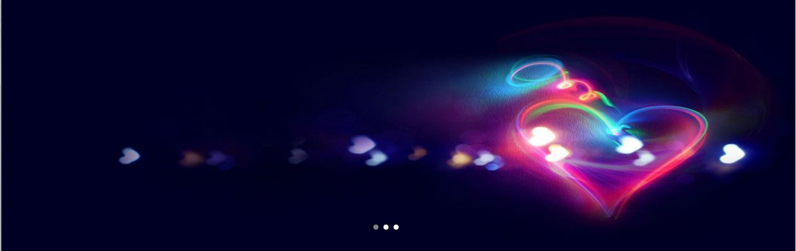

# 轮播图效果实现

**实现原理:**

自动轮播,也可以点击按钮选择要看的图片.主要就是实现ul列表的定位,以及不应用CSS3时,要达到运动的效果,应用定时器来完成.无缝切换,再轮回第一张图片时不会倒序.

**1.页面布局**

用一个div来把整个轮播组件包起来,然后用ul的li来承载图片;用一个div来承载按钮,按钮用a标签来实现.

```javascript
<div class='carousel'>
	<ul>
		<li></li>
		<li></li>
		<li></li>
	</ul>
	<div class='btnBox'>
		<a href="javascript:;"></a>
		<a href="javascript:;"></a>
		<a href="javascript:;"></a>
	</div>
</div>
```

**2.CSS的设置**

消去列表的小圆点,让li为浮动,以使得它们在一横排,对外层div设置overflow:hidden.

```javascript
	*{
	    padding: 0px;
	    margin:0px;
    }
	.carousel{
	    position: relative;
	    overflow: hidden;
	    min-width: 800px;
    }
	ul{
		list-style: none;
		position: absolute;
	}
	li{
		float: left;
	}
	.btnBox{
		position: absolute;
		width: 80px;
	}
	.btnBox>a{
		display: inline-block;
		border-radius: 5px;
		width: 8px;
		height: 8px;
		background: white;
	}	
	.btnBox>a:hover{
		background: grey;
	}

```

**3.js实现部分**

+ 列表`<ul>`要给一个长度,否则`<ul>`会依照屏幕大小自动换行(`float`也不能使它们排在一行)

+ 给`<a>`标签添加点击事件,同时要给对应的`<a>`标签添加索引,才能找到对应的图片

+ 自动播放时,主要就是应用一个定时器,每3秒切换当前的图片,在页面刚刷新进来时,第一个按钮不会有样式,可以人为填上,使得它处于活动状态.

+ 要使得点击事件和自动播放事件不冲突,那么自动播放事件要知道当前点击的按钮和正在播放的是哪张图片,这样它就知道下一张要放的按钮和要播放的图片.设置了两个标志位`index`和`index2`进行累加,在点击事件开始时,会清除自动播放的定时器,当点击事件中切换图片完成时,把当前点击的按钮的索引值赋给`index`和`index2`,以便自动播放时知道该播放那个图片,然后再次开启定时器,

+ 缓冲运动的实现,设置一个定时器,使得当前`obj`的位置不断改变`position=position+speed`,速度值`speed`与距目标的距离成正比,`speed=(iTarget-position)/10`;停止条件为`position==iTarget`,为了使得目标一定能到达指定位置,不会在指定位置之前停止,要对速度值进行处理,`speed=speed>0?Math.ceil(speed):Math.floor(speed)`,因为计算机会自动舍去小数部分,例如`speed=0.3`,那么就为0,速度值为0,则不动了,可此时并没有达到目标点;`speed=-0.8`,那么也是0,也不动了,实际上还没到达目标点,所以根据速度值的正负来进行处理.

+ 自动播放时,要实现无缝切换,除了可以改变DOM节点顺序外(这样做不好,性能低),还可以通过改变`<li>`的定位方式来实现,当移动到最后一张图片时,把`li[0]`变成`position:relative`,当`li[0]`移入视线内后,再把定位方式改成`static`,同时把整个`ul`的`left`变成0,作为一个回调函数传入缓冲运动函数,每当停止定时器时都会判断,是否已经切换到第一张图片了,如果切换到了,则改变`ul`的`left`值和`li[0]`的定位方式,同时更新`index2`的值为0.(`index`(用于标记按钮)的最大值就是2,而`index2`(用于标记当前显示的图片)的最大值是3)

```javascript
//运动框架  缓冲运动
function moveTo(iTarget,obj,callback){
	clearInterval(timer);
	var speed=0;
	var position=obj.offsetLeft;
	var timer=setInterval(function(){
		speed=(iTarget-position)/10;//小于0 则是从右向左  大于0 则是从左向右
		speed=speed>0?Math.ceil(speed):Math.floor(speed);//然后用三目运算符对速度进行处理,一面卡在某一像素处无法前进
		position=position+speed;
		if(position==iTarget){
			clearInterval(timer);
			if(callback){
				callback();
			}			
		}
		else{
			obj.style.left=position+'px';			
		}		
	},10);
	
}
		oA[0].style.background='grey';
		//给外层div高度,img撑不起容器高度
		box.style.height=height+'px';
		//设置列表的宽度,否则图片不会横向排列
		oUl.style.width=width*oImg.length+'px';
		//给图片设置宽高,填充满容器
		for(var i=0;i<oImg.length;i++){
			oImg[i].style.width=width+'px';
			oImg[i].style.height=height+'px';
		}

		//给btn按钮组定位
		oBtnBox.style.left=(document.documentElement.clientWidth-oBtnBox.offsetWidth)*0.5+'px';
		oBtnBox.style.top=height-50+'px';

		//给btn按钮添加功能
		
		for(var j=0;j<oA.length;j++){
				oA[j].index=j;
				oA[j].onclick=function(){
					//先把所有按钮都变成白色
				clearInterval(timer1);
					for(var k=0;k<oA.length;k++){
						oA[k].style.background='white';
					}
				oA[this.index].style.background='grey';				
				end=-this.index*width;				
				start=oUl.offsetLeft;
				moveTo(end,oUl);
				//为了使得自动播放接着当前点击的图片后播放,要把index值,和index2值进行更改,更改为当前点击的图片索引值.至于index值的判断以及index2值的处理都放在下面自动播放的函数中
				index=this.index;//点击后更改index的值  按钮值
				index2=this.index;//点击后更改index2的值  图片值
				timer1=setInterval(move,3000);
				}
			}
						
		//自动播放功能		
		function move(){
			if(index==oLi.length-1){
				oLi[0].style.position='relative';
				oLi[0].style.left=oLi.length*width+'px';
				index=0;
			}
			else{
				index=index+1;//累加 自动播放的下一张
			}
			index2++;
			for(var k=0;k<oA.length;k++){
					oA[k].style.background='white';
				}
			oA[index].style.background='grey';
			start=oUl.offsetLeft;
			end=-index2*width;
			moveTo(end,oUl,function(){				
				if(index==0){
					oLi[0].style.position='static';
					oUl.style.left=0+'px';
					index2=0;
				}
			});		
		}		
```

**4.问题**

+ 不能自适应,对img设置了大小,宽度始终为屏幕大小,当动态改变窗口大小时,轮播插件的宽度并不能随着变化,写了`onresize`事件,但是没解决目前.
